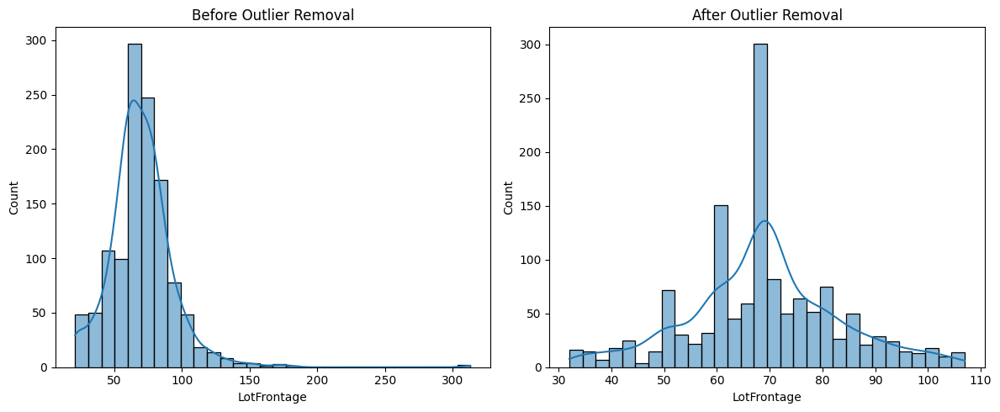

# Overview
This project aims to predict house prices based on various features such as location, size, number of rooms, and other attributes. Using Linear Regression, we build a predictive model that estimates house prices based on historical data. The project follows a structured Machine Learning workflow, covering data preprocessing, feature engineering, model training, and evaluation.

## Tools & Technologies Used
For this <b>House Price Prediction</b> project, I leveraged several key tools and technologies to explore, analyze, and model the data effectively:
- <b>Python</b>: The core programming language used for data analysis, visualization, and machine learning
    - <b>Pandas</b>: Used for data manipulation, handling missing values, and performing exploratory data analysis (EDA)
    - <b>NumPy</b>: Assisted in numerical computations and handling arrays efficiently
    - <b>Matplotlib</b>: Created visual representations of the data to identify patterns and trends
    - <b>Seaborn</b>: Enhanced data visualization with more advanced plots and statistical insights
- <b>Jupyter Notebook</b>: Served as the interactive environment for coding, visualization, and documentation
- <b>Visual Studio Code (VS Code)</b>: Used for writing, editing, and debugging Python scripts
- <b>Git & GitHub</b>: Essential for version control, tracking changes, and sharing the project publicly

## Project Steps
<b>Step 1</b>: Exploratory Data Analysis (EDA)

<b>Step 2</b>: Feature Selection

<b>Step 3</b>: Model Training & Evaluation

<b>Step 4</b>: Deployment

## Step 1: Exploratory Data Analysis (EDA)
### Data Analysis
- Checked missing values and filled them using:
    - <b>Numerical columns</b>: Filled with the median
    - <b>Categorical columns</b>: Filled with the mode
- Identified and removed duplicate rows
- Examined distributions of numerical variables

View my notebook with detailed steps here:
[1_Exploratory_Data_Analysis.ipynb](Project_Files/1_Exploratory_Data_Analysis.ipynb)

### Data Visualization
<b>Distribution of House Prices (Before & After Cleaning)</b>
```python
    fig, ax = plt.subplots(1, 2, figsize=(12,5))

    # Before cleaning
    sns.histplot(original_df['price'], bins=30, kde=True, ax=ax[0])
    ax[0].set_title('Before Data Cleaning')

    # After cleaning
    sns.histplot(cleaned_df['price'], bins=30, kde=True, ax=ax[1])
    ax[1].set_title('After Data Cleaning')

    plt.show()
```

### <b>Result</b>

 
*Before & After Data Cleaning*

### Insights
- House prices showed <b>strong correlation</b> with variables like square footage and number of bedrooms.

- Outliers and missing values <b>significantly affected data distribution</b>, requiring careful handling.

- Cleaning the data resulted in a <b>more stable and reliable dataset</b> for modeling.

## Step 2: Feature Selection
### Feature Analysis
- Identified categorical columns and applied One-Hot Encoding to convert them into numerical features
- Computed correlation with SalePrice and selected features with an absolute correlation ≥ 0.3
- Removed weakly correlated features to retain only the most relevant ones
- Checked for multicollinearity using Variance Inflation Factor (VIF) and iteratively dropped features with VIF > 5 to ensure model stability

View my notebook with detailed steps here:
[2_Feature_Selection.ipynb](Project_Files/2_Feature_Selection.ipynb)

### Data Visualization
<b>Final VIF values after removing high multicollinearity features:</b>

```python
from statsmodels.stats.outliers_influence import variance_inflation_factor

# Recalculating VIF
vif_data = pd.DataFrame()
vif_data['Feature'] = X_train_encoded_scaled.columns
vif_data['VIF'] = [variance_inflation_factor(X_train_encoded_scaled.values, i) for i in range(X_train_encoded_scaled.shape[1])]

# Sorting VIF
vif_data = vif_data.sort_values(by='VIF', ascending=False)

# Displaying VIF values
print(vif_data)
```
### <b>Result</b>

| Feature        | VIF  |
|----------------|------|
| OverallQual    | 3.18 |
| TotalBsmtSF    | 2.68 |
| FullBath       | 2.68 |
| BsmtFinSF1     | 1.95 |
| ...            | ...  |

### Insights
- <b>Highly correlated features</b> were removed to prevent redundancy and overfitting
- <b>VIF reduction</b> ensures the dataset is free from multicollinearity, leading to better model performance
- <b>Final feature set</b> is optimized for predictive modeling, improving interpretability and accuracy

## Step 3: Model Training & Evaluation
### Model Analysis
- Used Linear Regression as the base model
- Split the dataset into training (80%) and testing (20%)
- Trained the model using Scikit-Learn’s LinearRegression
- Evaluated performance using Mean Absolute Error (MAE) and R² Score

### Model Optimization
- <b>Feature scaling</b> improved model performance
- Regularization techniques like <b>Ridge Regression</b> could be explored

View my notebook with detailed steps here:
[3_Model_Selection_Training.ipynb](Project_Files\3_Model_Selection_Training.ipynb)

### Performance Metrics
<b>Final VIF values after removing high multicollinearity features:</b>

```python
from sklearn.metrics import mean_absolute_error, r2_score

mae = mean_absolute_error(y_test, y_pred)
r2 = r2_score(y_test, y_pred)
print(f"Mean Absolute Error: {mae}")
print(f"R² Score: {r2}")
```
### <b>Result</b>

- Mean Absolute Error: 23231.73
- R² Score: 0.8011

### Insights
- The model performed well on numerical features but can be improved by incorporating location-based features
- Adding more advanced regression techniques could enhance accuracy

## Step 4: Predictions & Future Improvements
### Making Predictions on New Data
```python
new_data = pd.DataFrame([
    [7, 856, 706, 854, 0, 192, 1, 65.0, 7, 84, 2],  # First house
    [5, 1262, 0, 0, 108, 0, 0, 80.0, 5, 0, 1]       # Second house
], columns=X_train_optimized.columns)

predictions = model.predict(new_data)
new_data['Predicted_SalePrice'] = predictions
print(new_data)
```
### <b>Result</b>
-------------------------------------------------------------------------------------------------------------------------------------------------------------------------
|2ndFlrSF | WoodDeckSF | OpenPorchSF | LotFrontage | BsmtFinSF1 | Fireplaces | MasVnrArea | TotRmsAbvGrd | FullBath | TotalBsmtSF | OverallQual | Predicted_SalePrice  |
|       7 |        856 |        706  |        854  |         0  |       192  |         1  |        65.0  |       7  |         84  |          2  |       1.949961e+06   |
|       5 |      1262  |         0   |         0   |       108  |        0   |         0  |        80.0  |       5  |          0  |          1  |       3.047532e+05   |
|         |            |             |             |            |            |            |              |          |             |             |                      |            

### Future Plans for Improvement
- Include location-based features (e.g., zip code, neighborhood, proximity to amenities)
- Experiment with different models such as Random Forest and Gradient Boosting
- Use Feature Engineering to create additional meaningful features
- Deploy the model as a web app using Flask or FastAPI

## Conclusion

This project demonstrates a <b>basic yet effective</b> house price prediction model using Linear Regression. While the model performs well based on the selected features, future improvements can be made by incorporating <b>location-based data</b> and exploring more advanced ML techniques. The structured approach ensures a solid foundation for future enhancements.